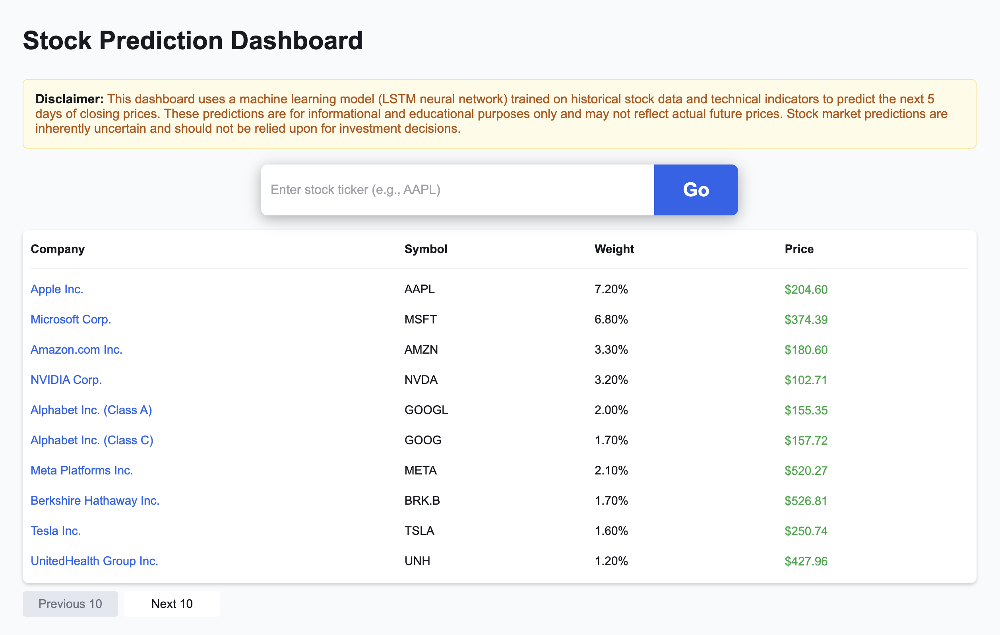
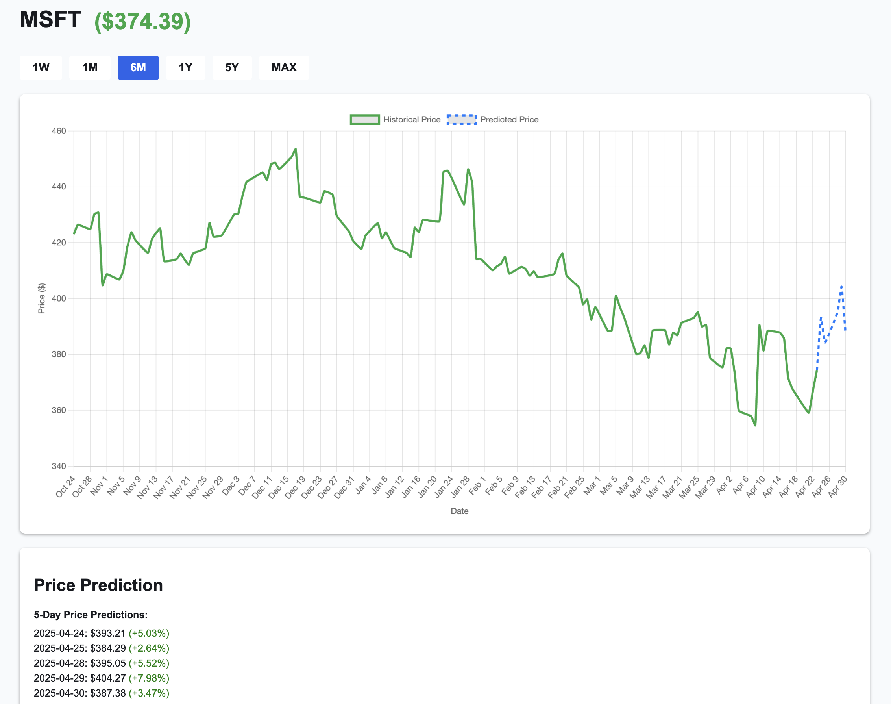

# Stock Prediction Dashboard

A web application that combines historical stock price visualization with machine learning-powered price predictions. Using an LSTM neural network model, it provides 5-day price forecasts for stocks (including all S&P 500 constituents) and major cryptocurrencies.


## Screenshots

### Main Dashboard


### Stock Detail View with Predictions


## Key Features

- **Advanced Historical Price Charts:** 
  - Interactive time-series visualization with Chart.js
  - Multiple timeframes: 1W, 1M, 6M, 1Y, 5Y, MAX

- **ML-Powered Price Predictions:**
  - 5-day price forecasts
  - Real-time prediction updates
  - Historical prediction accuracy tracking
  - Weekly model retraining for improved accuracy

## Technology Stack

- **Backend:** Python, Flask, PyTorch, yfinance, scikit-learn, pandas, numpy
- **Frontend:** HTML, CSS, JavaScript, Chart.js

## Setup Instructions

### Prerequisites

- Python 3.8+
- pip

### Installation

1. **Clone the repository:**
    ```bash
    git clone https://github.com/mraleko/Stock-Prediction-Dashboard.git
    ```

2. **Install dependencies:**
    ```bash
    pip install -r requirements.txt
    ```

3. **Run the backend server:**
    ```bash
    python backend.py
    ```
    The server will start at [http://localhost:5001](http://localhost:5001).

4. **Open the app:**
    - Open `http://localhost:5001` in your browser.

## Usage

- **Search for a stock:** Enter a ticker (e.g., `AAPL`) and click "Go".
- **View S&P 500 or Crypto:** Use the dashboard lists for quick access.
- **Change time period:** Use the time filter buttons above each chart.
- **View predictions:** See the next 5-day price forecast and percentage change.

## Model Architecture

### LSTM Neural Network
- Input layer: 60-day sequences (OHLCV + technical indicators)
- 2 LSTM layers with 64 hidden units each
- Dropout regularization (0.2) for overfitting prevention
- Dense output layer for 5-day price sequence prediction
- SmoothL1Loss for robust training

### Technical Indicators
- 10-day Moving Average (MA10)
- 20-day Moving Average (MA20)
- Relative Strength Index (RSI)

### Training Process
1. Data preprocessing and normalization
2. Weekly retraining schedule per ticker
3. Automatic model persistence and versioning
4. Historical prediction tracking for accuracy analysis

## Performance Monitoring

The dashboard tracks and displays:
- Prediction accuracy vs actual prices
- Percentage error analysis
- Historical prediction performance

## Disclaimer

This dashboard is for informational and educational purposes only. Predictions are not financial advice.

## File Structure

```
├── backend.py                # Flask backend server, ML models, data processing
├── requirements.txt          # Python package dependencies
├── app.js                    # Main dashboard JavaScript
├── stock.js                  # Individual stock page JavaScript
├── stock.html                # Individual stock view template
├── static/
│   ├── style.css             # Global styles and theme system
│   └── index.html            # Main dashboard template
├── stock_models/             # Trained model storage
│   ├── <ticker>_model.pth    # PyTorch model weights
│   ├── <ticker>_meta.json    # Model metadata
│   └── predictions/          # Historical predictions
```
